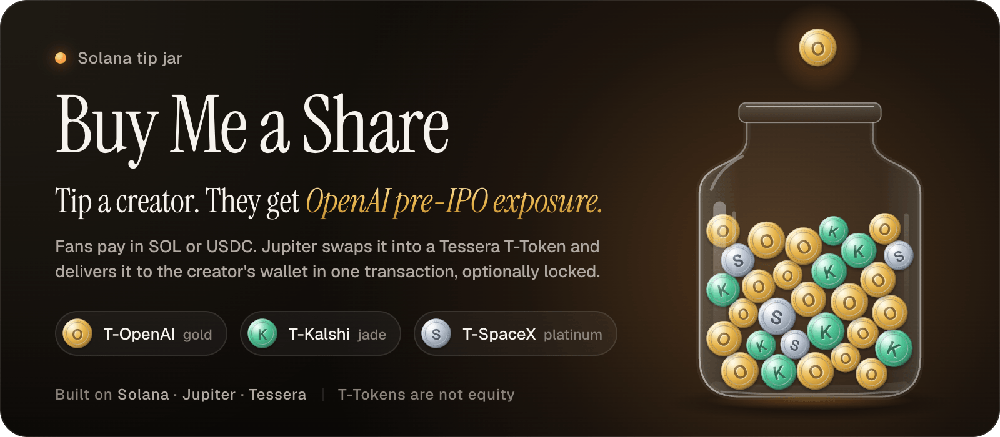
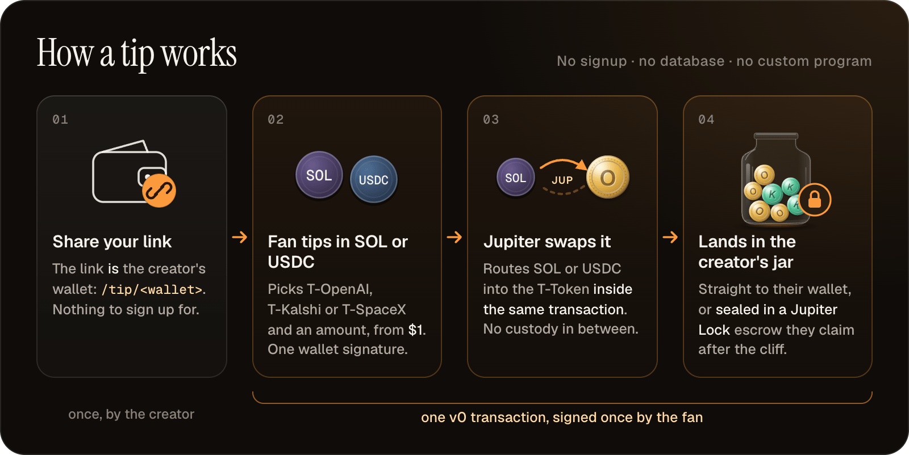
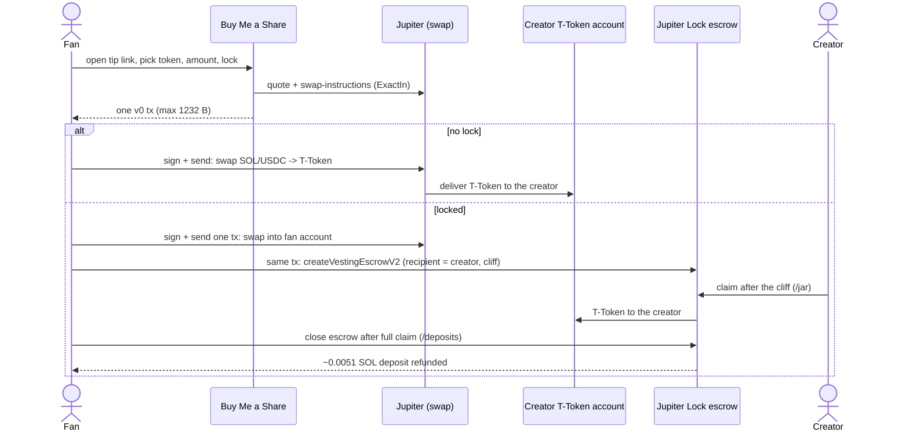
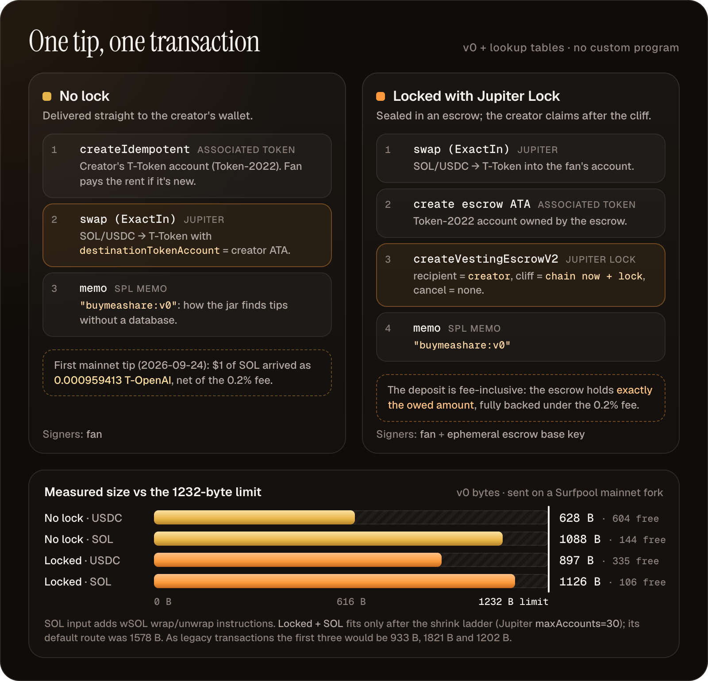
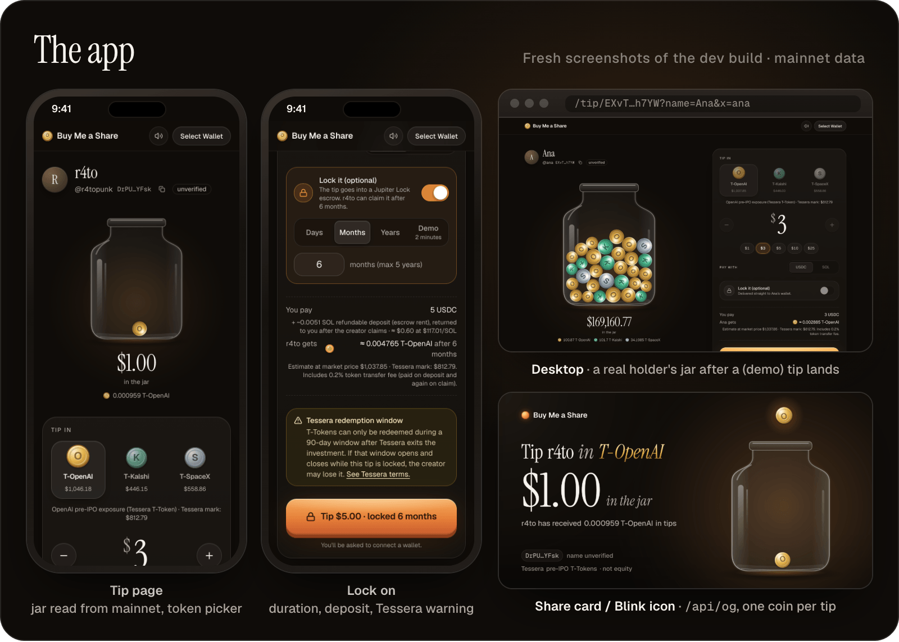
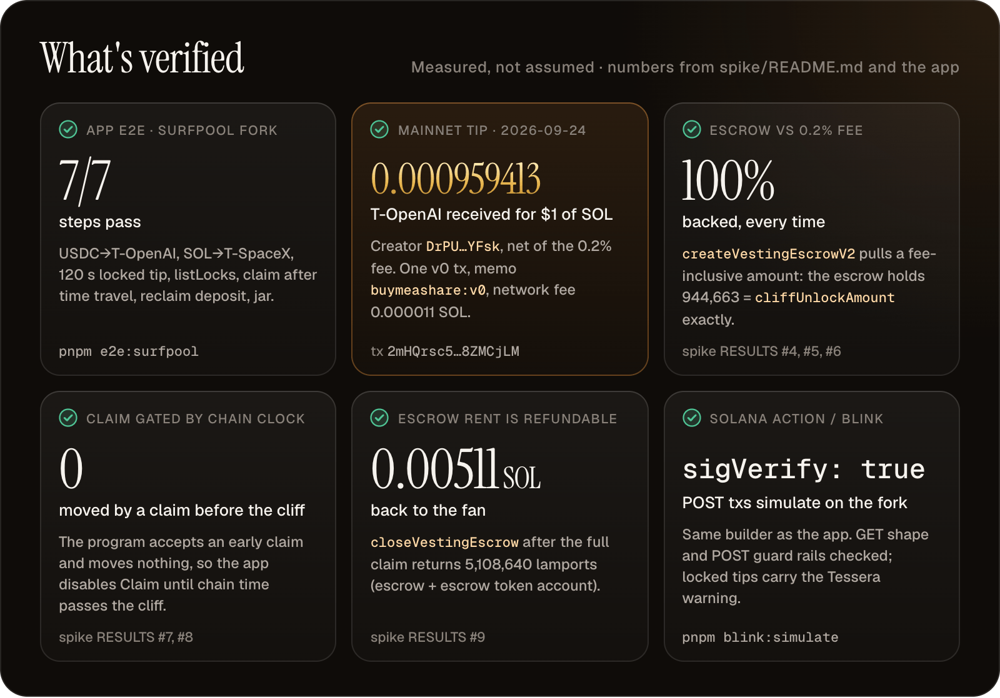
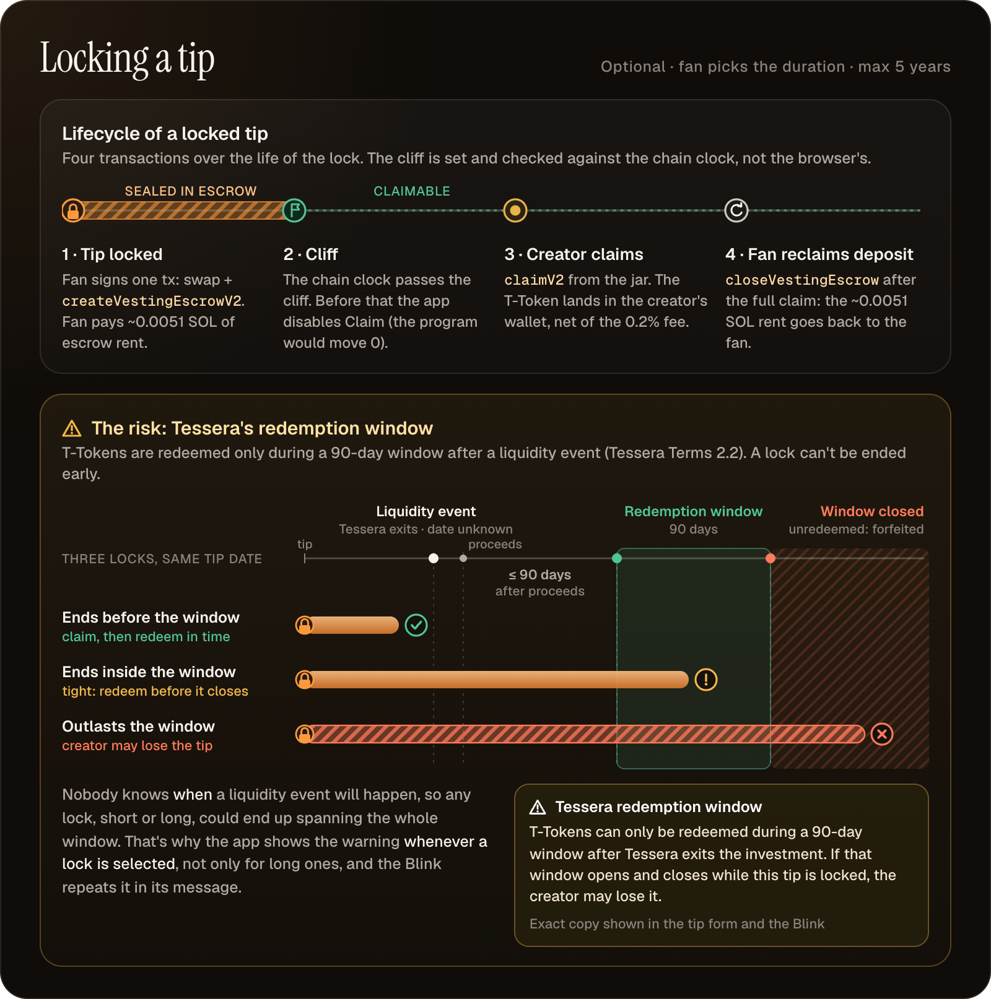

# Buy Me a Share



**Tip a creator $1 or more and it lands in their wallet as T-OpenAI, a Tessera pre-IPO T-Token, in a single Solana transaction.**

Built for the Solana Stocklana hackathon: Consumer track + Tessera bounty. Production domain: `buymeashare.r4to.com` (see [Deploy](#deploy)).

> T-Tokens are issued by Tessera. They are Stablecoin Loan Tokens, **not equity**, and are not available to U.S. persons or residents of excluded jurisdictions. See [docs/tessera-terms.md](docs/tessera-terms.md) and the [Tessera Terms](https://terms.tessera.pe/terms-and-conditions).

## The problem

| | |
|---|---|
| Pre-IPO access | People like the founder want exposure to OpenAI, SpaceX or Kalshi before an IPO. Most don't know that's possible on-chain today (Tessera T-Tokens on Solana). |
| Tipping is already a habit | Buy Me a Coffee, Pix tips, Ko-fi: everyone already knows how to tip a creator a few dollars. |
| The idea | Keep the tip habit and change what arrives. The tip reaches the creator as T-OpenAI / T-Kalshi / T-SpaceX, not as cash. "It's Buy Me a Coffee, but the coffee is OpenAI pre-IPO exposure." |

## How it works




1. The creator pastes their wallet on `/` and gets a link: `/tip/<wallet>?name=&x=`. No signup and no database, because the link is the wallet.
2. The fan opens the link, picks a token (T-OpenAI, T-Kalshi, T-SpaceX), an amount ($1 minimum) and pays with SOL or USDC.
3. The app asks Jupiter for an ExactIn route and builds **one** v0 transaction:
   - **No lock:** Jupiter swap with `destinationTokenAccount` set to the creator's T-Token account, plus a memo.
   - **Locked** (optional, the fan picks the duration, up to 5 years, $5 minimum): swap into the fan's account, then `createVestingEscrowV2` on Jupiter Lock, with the creator as recipient and the cliff set to chain time + duration.
4. The creator's jar (`/jar/<wallet>`) reads holdings and memo-tagged tips straight from mainnet.
5. After the cliff, the creator claims the locked tip from the jar.
6. After the full claim, the fan reclaims the escrow deposit (~0.0051 SOL rent) on `/deposits/<wallet>`.



## Why Solana


*The instructions inside the single v0 transaction, unlocked and locked, with measured sizes against the 1232-byte limit.*


| Property | What it enables here |
|---|---|
| 1232 B v0 transactions + address lookup tables | Swap + deliver (628 B USDC / 1088 B SOL) or swap + lock (897 B / 1126 B) fit in **one** transaction, so the flow works as a single Blink click |
| Sub-cent fees | A $1 tip is viable (the first mainnet tip paid 0.000011 SOL in network fees) |
| Token-2022 | T-Tokens are Token-2022 mints with a 20 bps transfer fee; the app does the fee math so estimates are exact |
| Blinks / Solana Actions | The same tip works from a link unfurl (`/api/actions/tip/[wallet]`, `/actions.json`) |
| Jupiter routing | USDC or SOL to T-Token through Meteora DLMM and multi-hop routes, delivered to a third-party account |
| Jupiter Lock | Time-locked tips without writing or auditing an escrow |
| No custom program | Everything is composed from Jupiter, Jupiter Lock, SPL Memo and Token-2022. Nothing to deploy or audit |

## Features


*Tip page, lock panel with the Tessera warning, desktop jar (dev demo animation) and the share card.*


- Tip page with token picker, amount, SOL/USDC, optional lock (days/months/years, up to 5 years)
- Creator jar: holdings, tip history, locked tips with a Claim button gated on the **chain** clock
- Fan deposits page: reclaim the escrow rent after the creator claims
- Solana Action / Blink with the same builder, and the Tessera lock warning in the POST `message`
- Share card / Blink icon via `/api/og`: a glass jar filled with coins
- Prices from Jupiter (market), with the Tessera mark shown next to them
- Compliance copy baked in: Tessera notice, visible lock warning, "includes 0.2% token transfer fee", unverified name badge

## What's verified




| Check | Result |
|---|---|
| Feasibility spike on a Surfpool mainnet fork | Swap-to-creator, swap + lock in 1 tx, claim after cliff, close escrow. All sent. RESULTS table in [spike/README.md](spike/README.md) |
| App e2e on Surfpool (`pnpm e2e:surfpool`) | **7/7** steps: USDC→T-OpenAI, SOL→T-SpaceX, 120 s locked tip, listLocks, claim after time travel, reclaim deposit, jar |
| Blink (`pnpm blink:simulate`) | GET shape, POST guard rails, POST txs simulate with `sigVerify:true` on the fork |
| **First real mainnet tip** (2026-09-24) | $1 SOL → T-OpenAI to creator `DrPUR2AiAk9rp1NJDs3dQn73xZt1nTG3jLKZzqsLYFsk`, which received **0.000959413 T-OpenAI** (net of the 0.2% fee). Tx [`2mHQrsc5…8ZMCjLM`](https://solscan.io/tx/2mHQrsc5fpxJDcQEyKqdK7SZso9TZAZx4TbtonyHGpnAPeAJQ5RB2zGH1omzZgYMFmZ7BfaThoaN2Z8Xd8ZMCjLM) |

Measured numbers and open questions: [docs/feasibility.md](docs/feasibility.md).

## Legal / compliance constraints


*Lock lifecycle and why the app warns about Tessera's 90-day redemption window whenever a lock is selected.*


| Constraint (Tessera Terms, revised 28 Aug 2026) | Product rule |
|---|---|
| T-Tokens are Stablecoin Loan Tokens (a USDC loan to a Panamanian issuer), not equity (1.4, 1.5) | Copy never calls the token a share, equity or stock. We say "T-OpenAI" or "OpenAI pre-IPO exposure (Tessera T-Token)" |
| U.S. persons and excluded jurisdictions can't use Tessera (3.1(c)) | Notice on the landing and tip pages; launch aimed at non-U.S. audiences |
| Redemption only in a 90-day window after a Liquidity Event; unredeemed tokens are forfeited (2.2) | Every lock shows a visible warning that a long lock could span the window |

Details, section by section, and what's still UNKNOWN: [docs/tessera-terms.md](docs/tessera-terms.md). None of this is legal advice.

## Quick start

```fish
cd app
cp .env.example .env.local   # optional; defaults to the public mainnet RPC
pnpm install
pnpm dev                     # http://localhost:3000
pnpm lint
```

Try it with a real T-OpenAI holder: `/tip/EXvTtxurWBUNNCtLojaN8ZBJFNJPZFSH3szoih9hh7YW?name=Ana&x=ana`. Local-fork e2e and demo flags: [app/AGENTS.md](app/AGENTS.md).

## Deploy

| Step | Value |
|---|---|
| Vercel project | Root Directory `app` (Next.js preset) |
| Env vars | See [app/.env.example](app/.env.example). Production: `RPC_URL` = keyed mainnet RPC (Helius/Triton/QuickNode, needs `getProgramAccounts`), `NEXT_PUBLIC_SITE_URL=https://buymeashare.r4to.com`. Leave `NEXT_PUBLIC_DEMO_LOCK_SECONDS` unset |
| RPC safety | The browser always talks to the same-origin `/api/rpc` proxy (method allowlist), so the keyed URL stays server-side in `RPC_URL` |
| Domain | `buymeashare.r4to.com` added in Vercel → Domains |
| DNS (Cloudflare) | `CNAME buymeashare` → the target Vercel shows (usually `cname.vercel-dns.com`), proxy status **DNS only** (grey cloud) so Vercel can issue the certificate |

## Repo layout

| Path | What |
|---|---|
| [`app/`](app/) | Next.js 16 app: tip page, creator jar, fan deposits, Solana Action / Blink, OG images, RPC proxy. Dev guide: [app/AGENTS.md](app/AGENTS.md) |
| [`spike/`](spike/) | Feasibility spike on a Surfpool mainnet fork (swap-to-other, swap-and-lock, claim, close escrow). Results: [spike/README.md](spike/README.md) |
| [`docs/`](docs/) | Judge/teammate docs (below) |

## Docs

| Doc | What |
|---|---|
| [docs/product-decisions.md](docs/product-decisions.md) | Decision log: product, lock, pricing, UX, distribution, testing |
| [docs/tessera-terms.md](docs/tessera-terms.md) | What the Tessera Terms say and how each clause maps to a product rule |
| [docs/feasibility.md](docs/feasibility.md) | Measured facts: Jupiter quotes, mint facts, Jupiter Lock behavior, tx sizes, open UNKNOWNs |
| [docs/demo-script.md](docs/demo-script.md) | ~2 min demo video script + dev demo flags |
